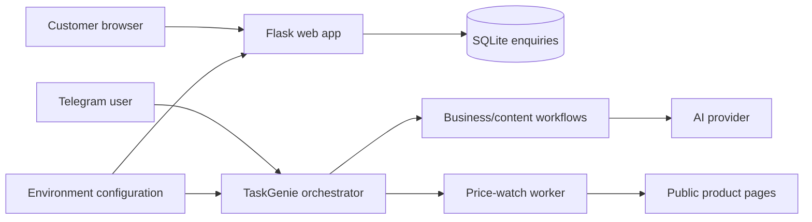

# TaskGenie

[](https://github.com/craftycoder47/TaskGenie/actions/workflows/test.yml)

TaskGenie is a Python prototype for small-business workflow automation. It combines a customer enquiry web app with a Telegram-based assistant for generating practical business content and monitoring product prices.

The public repository is a portfolio/research edition. It contains no production credentials and does not claim that external integrations are live unless they have been separately verified.

## Current verification status

| Area | Status | Evidence |
| --- | --- | --- |
| Python source | Verified | GitHub Actions compiles the main Python entry points |
| Web app | Tested | Health, home, privacy, enquiry storage, validation, JSON input and rate limiting have automated tests |
| SQLite enquiry storage | Tested | Test suite verifies submitted enquiry data is persisted correctly |
| Telegram worker | Build/config boundary tested | Source compiles and missing-token behaviour is fail-closed |
| AI provider integration | Configuration boundary tested | Missing AI configuration returns a safe user-facing message |
| Live Telegram/API deployment | Not claimed | Requires private runtime credentials and a running deployment |
| Price-watch behaviour against arbitrary websites | Prototype | Depends on third-party page structure and network availability |

## Architecture



## Main capabilities

- Small-business enquiry landing page and privacy page
- Customer enquiry validation and SQLite persistence
- Basic abuse/rate limiting for enquiry submissions
- Guided 7-day Business Growth Pack workflow
- Social-content, CV/cover-letter and newsletter helpers
- Product-price watch prototype
- Per-feature free-use tracking and optional premium unlock flow
- Safe provider-error handling so raw API exceptions are not exposed to users

## Run the automated tests

The currently validated CI runtime is Python 3.12 on Ubuntu.

```bash
python -m venv .venv
source .venv/bin/activate
pip install -r requirements.txt
pytest -q
```

GitHub Actions also compiles the two primary entry points before running the tests.

## Run the web app locally

```bash
export DATA_DIR=/tmp/taskgenie-data
python web_app.py
```

The deployment process definition uses:

```text
web: gunicorn web_app:app
worker: python orchestrator_bot.py
```

## Worker configuration

The Telegram worker reads configuration from environment variables rather than hard-coding credentials:

- `TELEGRAM_TOKEN` — required to start the Telegram worker
- `ANTHROPIC_API_KEY` — required for AI-generated responses
- `ADMIN_CHAT_ID` — optional owner/admin chat identifier
- `PAYMENT_LINK` — optional external payment link
- `TASKGENIE_MODEL` — optional model override
- `DATA_DIR` — optional writable data directory

If `TELEGRAM_TOKEN` is absent, the worker refuses to start. If the AI client is not configured, AI features return a clear configuration message rather than exposing provider details.

## Repository structure

```text
TaskGenie/
├── orchestrator_bot.py        # Telegram workflows and price-watch logic
├── web_app.py                 # Flask enquiry web app
├── web/templates/             # Customer-facing HTML templates
├── tests/                     # Automated regression tests
├── .github/workflows/test.yml # CI
├── Procfile                   # web + worker process definitions
└── requirements.txt
```

## Safety and scope

This repository is intended to demonstrate Python automation, web application design, validation, persistence, testing and safe configuration handling.

It does **not** include API keys, Telegram tokens, passwords, customer databases or other production secrets. AI output should be reviewed before publication, and the price-watch component should be treated as a prototype because third-party websites can change their markup or block automated requests.

## Portfolio status

**Verified:** source compilation, web-app regression tests, enquiry persistence/validation and CI.

**Not yet proven by this repository alone:** a continuously running public deployment, live Telegram delivery, live AI-provider responses, payment processing, or reliable scraping across arbitrary retail websites.
